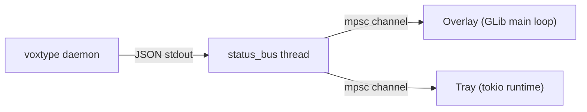

# Voxtype GUI

Graphical user interface for Voxtype — a GTK4/libadwaita desktop experience for managing settings, monitoring daemon state, and providing visual feedback during recording.

## Table of Contents

- [Overview](#overview)
- [Launching the GUI](#launching-the-gui)
- [Components](#components)
  - [System Tray Icon](#system-tray-icon)
  - [Recording Overlay](#recording-overlay)
  - [Settings Window](#settings-window)
- [Architecture](#architecture)
  - [Shared Status Bus](#shared-status-bus)
  - [Thread Model](#thread-model)
- [Building with GUI Support](#building-with-gui-support)
- [Configuration via GUI](#configuration-via-gui)
- [Troubleshooting](#troubleshooting)

---

## Overview

The GUI runs as a GTK4/libadwaita application alongside the Voxtype daemon. It provides three components:

1. **System tray icon** — shows daemon state (idle/recording/transcribing/stopped) in
   your desktop panel
2. **Recording overlay** — a floating waveform window that appears during recording
3. **Settings window** — a preferences panel for all configuration options

The GUI does not replace the CLI. It communicates with the daemon exclusively through existing CLI commands (`voxtype status --follow`, `voxtype record start/stop/cancel`).

## Launching the GUI

```bash
# Start the GUI (tray icon + overlay monitor)
voxtype ui

# Start the GUI and open settings immediately
voxtype ui --settings
```

The GUI uses single-instance enforcement via D-Bus (`io.github.voxtype.Voxtype`). Running `voxtype ui` a second time raises the existing instance instead of starting a new one.

## Components

### System Tray Icon

The tray icon uses the [StatusNotifierItem](https://www.freedesktop.org/wiki/Specifications/StatusNotifierItem/) D-Bus protocol via the `ksni` crate.

**States:**

| State | Icon | Description |
|---|---|---|
| Idle | `microphone-sensitivity-muted-symbolic` | Daemon is running, not recording |
| Recording | `microphone-sensitivity-high-symbolic` | Actively recording audio |
| Transcribing | `document-edit-symbolic` | Processing speech to text |
| Stopped | `microphone-disabled-symbolic` | Daemon is not running |

**Context menu actions:**

- Toggle recording
- Open settings
- Update notification (when a new version is available)
- Quit

**Requirements:** A StatusNotifierHost must be running (GNOME needs the [AppIndicator extension](https://extensions.gnome.org/extension/615/appindicator-support/), KDE and other DEs typically include one by default).

### Recording Overlay

A small floating window (~280×56 px) that appears during recording:

- **Waveform visualization** — animated bars driven by real-time audio level data
- **Recording timer** — displays elapsed time (mm:ss)
- **Cancel button** — click ✕ or press Escape to cancel recording
- **Transcribing indicator** — spinner animation when processing

The overlay is a `UTILITY`-type window (always-on-top, no taskbar entry), positioned at the bottom-center of the screen.

### Settings Window

An `AdwPreferencesWindow` with five pages:

| Page | Settings |
|---|---|
| Audio | Input device, max recording duration, audio feedback toggle, service restart |
| Transcription | Whisper model, language, backend, service restart |
| Raccourcis (Hotkeys) | Hotkey string, enable/disable, push-to-talk vs toggle mode |
| Service | Daemon status indicator (running/stopped), real-time monitoring |
| Mises à jour | Automatic update check toggle |

**Service restart:** Both Audio and Transcription pages include a "Restart service" button that runs `systemctl --user restart voxtype` with visual feedback (label changes to show progress, success ✓, or failure ✗, then auto-resets after 3 seconds).

## Architecture

### Shared Status Bus

A single `voxtype status --follow --format json` subprocess feeds both the overlay and the tray:



This design ensures only one subprocess monitors daemon state, regardless of how many consumers need it. If the subprocess exits, the bus automatically reconnects after a delay and sends a synthetic `{"class":"stopped"}` event to all consumers.

**Module:** `src/gui/status_bus.rs`

### Thread Model

```
Main thread (GTK4/GLib)
├── Overlay — polls status_bus receiver every 50ms
├── Settings window — UI callbacks
└── Quit flag poller — checks tray quit signal every 250ms

status-bus thread (std::thread)
└── Reads subprocess stdout, fans out to 2 mpsc channels

voxtype-tray thread (tokio multi-thread runtime)
├── ksni StatusNotifierItem (D-Bus)
├── monitor_state — bridges sync receiver to async tokio channel
└── check_for_updates_periodic — curl GitHub API every 24h
```

**Key constraints:**

- GTK4 objects (`Button`, `Window`, etc.) are **not `Send`** — they must stay on the main thread
- The tray needs a tokio runtime for `ksni`/`zbus` D-Bus communication
- Background work (systemctl restart, update checks) uses `std::thread::spawn` + `mpsc::channel` + `glib::timeout_add_local_once` polling pattern to bridge results back to the main thread

### Configuration Persistence

Settings are persisted to `~/.config/voxtype/config.toml` (via XDG `directories::ProjectDirs`).

**Write strategy:**

1. Line-based TOML editing preserving comments and file structure
2. Atomic write via temporary file + `rename(2)` to prevent corruption
3. Existing keys are updated in-place; missing keys are appended to their section; missing sections are created at the end of the file

## Building with GUI Support

The GUI is gated behind the `gui` feature flag:

```bash
# Build with GUI
cargo build --release --features gui

# Build without GUI (CLI only)
cargo build --release
```

**Dependencies (system packages):**

| Package | Fedora | Ubuntu | Arch |
|---|---|---|---|
| GTK4 dev | `gtk4-devel` | `libgtk-4-dev` | `gtk4` |
| libadwaita dev | `libadwaita-devel` | `libadwaita-1-dev` | `libadwaita` |

**Rust crate dependencies** (pulled automatically via Cargo):

- `gtk4` 0.9
- `libadwaita` 0.7 (with `v1_4` feature)
- `ksni` 0.3.3

## Configuration via GUI

All settings modified through the GUI are written to the same `config.toml` file used by the CLI. Changes take effect after restarting the service (use the "Restart service" button in the GUI).

See the [Configuration Reference](CONFIGURATION.md) for the complete list of available options.

## Troubleshooting

### Tray icon does not appear

You need a StatusNotifierHost. On GNOME, install the [AppIndicator extension](https://extensions.gnome.org/extension/615/appindicator-support/). Check logs:

```bash
voxtype ui 2>&1 | grep -i tray
```

### Overlay does not show during recording

The overlay relies on `voxtype status --follow --format json`. Verify the daemon is running:

```bash
voxtype status
```

### Settings not saved

Check file permissions on `~/.config/voxtype/config.toml`. The GUI writes via atomic rename — both the config file and its parent directory must be writable.

### GUI won't start (second instance)

The GUI uses D-Bus single-instance. If a previous instance crashed without cleaning up:

```bash
busctl --user list | grep voxtype
# If listed, the old instance is still holding the name.
# Kill it or wait for D-Bus to release the name.
```
